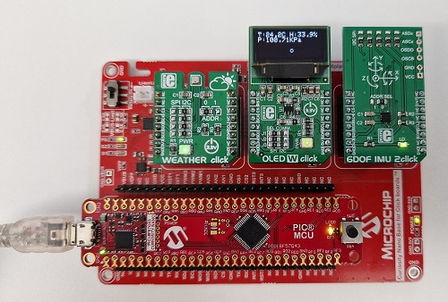

# PIC18F57Q43_OLED_Weather_6DOF

This project uses the PIC18F57Q43 with 3 click boards:
- Weather click (BME280)
- OLEDW click (96x96 pixels)
- 6DOF IMU 2click (BMI160)

The PIC and click boards are connected to Curiosity Nano Base for Click Boards as shown in the picture below. This order is important as the interrupt pins from the click boards are mapped to the pins on the PIC.



The readings from the sensors are displayed on the OLED.
The program also make available a serial console for that visualizing and additional functionality to read and write the registers of 6DOF sensor.

An example of the serial console output is shown below.

```
------------------------------------------------------------------
PIC18F57Q43 Curiosity Development Board Demo                      
1[Weather (BME280)] 2[OLEDW 96x96] 3[IMU_6DOF 2]                  
------------------------------------------------------------------
c - Clear screen 
> - Send text to OLED, ex: >Show this!
6 [ ] [...] - Interact with 6DOF sensor:
   r        - reset 
   d        - dump memory 
   g R      - get memory data at R address: 6 g 00
   s R D:   - set memory data at R address: 6 s 7E B0 (reset)

Weather         T: 22.61C       H: 34.5%        P: 101.16KPa      
Accelerometer   x:  -160        y:  -642        z:+17963   
Gyroscope       x:    +2        y:    -7        z:    -4       
```

## 6DOF IMU 2click
This board has the BMI160 sensor which provides accelerometer and gyroscope readings. It has builtin algorithms to detec gestures and produce interrupts for single tap, double tap, flat position, step, any-motion, no-motion, etc.

This project implemented the accelerometer X-Axis reading displaying a Bubble in the middle of the display which scrolls from left-to-right according to the board's position on the X-Axis.

If a single-tap or double-tap happens on any Axis, this is also displayed due characters like <, <<, >, >>, /\\, //\\\\, \\/, and \\\\//, (+), ((+)), (-), ((-)).

Double-tap on the right or left X-Axis increases or decreases the OLED contrast. 

## Software Architecture - Tasks
A task module was implemented where a control function is called each 1ms.

```
Timer0_OverflowCallbackRegister(Task_synch);
```

Tasks are registered, modified, or deleted as needed. Tasks are configured to be executed at a specific repeat rate or only once.

```
Task_register(0, BUBBLE_TIME, scrollBubble);
Task_register(100, IMU_6DOF_TIME, print6DOFData);
Task_register(1000, WEATHER_PRINT_TIME, printWeatherData);
```

This task will be executed only once after the interrupt has being recognized:

```
Task_register(IMU_6DOF_CLICK_TIME, 0, clearClick);
```

To execute the Task module, insert the Task_execute function at the main loop:

```
    while(1)
    {
        Task_execute();
        ...
```

